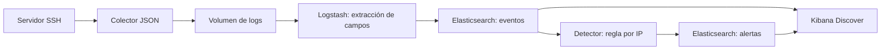

# Mini SIEM y analizador de logs

Laboratorio local para aprender ingestión de eventos, análisis de autenticación y detección de posibles ataques de fuerza bruta con Docker y ELK.



El colector conserva el mensaje original y añade fecha UTC e identificador. Logstash extrae usuario, IP, puerto y resultado de las autenticaciones con contraseña. Los demás mensajes de SSH también se almacenan. El detector consulta Elasticsearch cada cinco segundos y guarda las alertas; Kibana permite buscar tanto eventos como alertas. No se envían correos ni notificaciones externas.

## Requisitos y arranque

- Docker Desktop iniciado, con contenedores Linux y Docker Compose.
- Como punto de partida, asigna 6 GB de RAM y 10 GB de disco libre a Docker; el consumo aumenta con los logs.
- Python 3.10 o posterior para ejecutar las pruebas desde el equipo anfitrión.
- Puertos locales 2222, 5601 y 9200 disponibles.

Desde esta carpeta, en PowerShell:

```powershell
Copy-Item .env.example .env
# Edita SSH_PASSWORD en .env si deseas otra contraseña de laboratorio.
docker compose config --quiet
docker compose up -d --build
docker compose ps -a
docker compose logs -f setup kibana-setup logstash detector
```

En Linux/macOS usa `cp .env.example .env` para el primer paso. La primera descarga puede tardar varios minutos. `setup` y `kibana-setup` son tareas puntuales: deben terminar con código 0. Los otros cinco servicios deben seguir activos. Espera a que Logstash indique que el pipeline está iniciado antes de generar eventos. `Ctrl+C` sale de la visualización de logs sin detener los contenedores.

| Servicio | Acceso |
| --- | --- |
| Kibana | http://localhost:5601 |
| Elasticsearch | http://localhost:9200 |
| SSH | `ssh -p 2222 analyst@127.0.0.1` |

La contraseña de `analyst` es `SSH_PASSWORD` de `.env`. La configuración predeterminada de ejemplo es pública y exclusiva del laboratorio. ELK funciona sin autenticación ni TLS y los puertos se publican únicamente en `127.0.0.1`. Usa este despliegue en un equipo local de confianza; no es una configuración de producción.

## Prueba completa

Con el pipeline listo y los parámetros predeterminados:

```powershell
python scripts/smoke.py
```

La prueba realiza **cinco autenticaciones SSH fallidas reales** contra el servidor del propio contenedor y después comprueba un acceso correcto. No acepta destinos externos. Espera hasta tres minutos por los eventos y la alerta en Elasticsearch; termina con error si falta alguno. La IP del caso de prueba es `127.0.0.1`, porque el cliente se ejecuta dentro del contenedor SSH. Los accesos desde el anfitrión pueden aparecer con la IP de la pasarela Docker.

Resultado esperado: `Prueba integral OK`, al menos cinco fallos, un éxito y una alerta. Si repites la prueba, espera **120 segundos** desde la última alerta para que termine la supresión de duplicados. Un umbral superior a cinco o una ventana demasiado pequeña requiere adaptar el escenario de prueba.

Para generar el escenario sin verificación automática:

```powershell
docker compose exec ssh python /app/demo.py
```

## Investigar en Kibana

Abre **Discover**, selecciona `Mini SIEM — logs` y fija el período en **Last 15 minutes**. Las vistas se crean automáticamente mediante `kibana-setup`.

Consultas KQL útiles:

```text
event.outcome: "failure"
event.outcome: "success"
source.ip: "127.0.0.1"
tags: "_grokparsefailure"
```

Añade las columnas `@timestamp`, `source.ip`, `user.name`, `event.outcome` y `message`. En la vista `Mini SIEM — alerts`, consulta `rule.id: "ssh-repeated-failures"` y revisa `alert.count`, `alert.window_seconds` y `source.ip`.

Como ejercicio, crea visualizaciones de fallos a lo largo del tiempo, principales IP de origen y usuarios afectados. El proyecto configura vistas de datos; no incluye un dashboard preconstruido.

## Regla personalizada

La regla `ssh-repeated-failures` genera una alerta de severidad `high` cuando una IP acumula al menos cinco eventos `failure` del conjunto `ssh.auth` durante los últimos 60 segundos. Los accesos correctos no cuentan como fallos. La alerta expresa una sospecha; no bloquea conexiones.

| Variable en `.env` | Predeterminado | Función |
| --- | --- | --- |
| `FAILURE_THRESHOLD` | 5 | Mínimo de fallos de una misma IP |
| `WINDOW_SECONDS` | 60 | Ventana móvil por fecha del evento |
| `COOLDOWN_SECONDS` | 120 | Tiempo mínimo entre alertas de esa IP |
| `POLL_SECONDS` | 5 | Intervalo de consulta |

Después de modificar los parámetros:

```powershell
docker compose up -d detector
```

La supresión consulta las alertas persistidas, por lo que sobrevive a reinicios. Ejecuta una sola instancia del detector: no hay coordinación entre réplicas. Se recorren las IP mediante agregaciones paginadas. La latencia incluye la lectura de Logstash, el refresco del índice y el sondeo.

Esta versión detecta accesos **con contraseña** y usa la fecha de captura del mensaje. Si la ingestión o el detector se retrasan más que la ventana, pueden perderse detecciones: no hay recuperación histórica. Tampoco distingue ataques distribuidos ni equipos detrás de una IP compartida. Logs e índices persisten en volúmenes, pero no tienen rotación ni política de retención; reserva este diseño para sesiones acotadas de laboratorio.

## Pruebas y mantenimiento

```powershell
python -m unittest discover -s tests -v
docker compose --env-file .env.example config --quiet
docker compose logs --tail 100 logstash detector ssh
docker compose down
```

`down` conserva los datos. Para **eliminar todos los logs, índices y claves SSH del laboratorio**, ejecuta explícitamente `docker compose down -v`. La siguiente conexión SSH puede avisar que cambió la clave del servidor.

Archivos principales:

- `compose.yaml`: servicios, volúmenes y dependencias.
- `ssh/`: servidor de laboratorio, colector y escenario de prueba.
- `logstash/pipeline.conf`: normalización de mensajes de autenticación.
- `siem/app.py`: índices, vistas de Kibana, regla y verificación.
- `tests/`: pruebas unitarias del detector y colector.
- `scripts/smoke.py`: prueba integral con autenticaciones reales.

## Si algo falla

- **Docker devuelve 500 o no responde:** comprueba que Docker Desktop haya terminado de arrancar y que esté usando contenedores Linux. `docker version` debe mostrar tanto Client como Server. Este problema impide iniciar el laboratorio aunque Compose sea válido.
- **Elasticsearch no inicia:** revisa `docker compose logs elasticsearch`. Si reclama `vm.max_map_count`, sigue las instrucciones oficiales para tu entorno Docker/WSL; si finaliza con código 137, revisa la memoria disponible.
- **Kibana aún no está lista:** espera al arranque y revisa `docker compose logs kibana kibana-setup`. Puedes repetir la creación de vistas con `docker compose run --rm kibana-setup`.
- **No llegan eventos:** revisa `docker compose logs ssh logstash` y `docker compose exec ssh tail /logs/auth.jsonl`. Los mensajes conservan un identificador usado como ID del documento para evitar duplicados por relectura.
- **Hay fallos pero no alertas:** comprueba ventana, umbral, cooldown, período de Discover y `docker compose logs detector`. Genera eventos nuevos después de que el pipeline esté listo.

## Referencias

- [Elasticsearch: nodo único en Docker](https://www.elastic.co/docs/deploy-manage/deploy/self-managed/install-elasticsearch-docker-basic).
- [Logstash: entrada de archivos y persistencia de posición](https://www.elastic.co/docs/reference/logstash/plugins/plugins-inputs-file).
- [Logstash: salida a Elasticsearch](https://www.elastic.co/docs/reference/logstash/plugins/plugins-outputs-elasticsearch).
- [Kibana: API para crear vistas de datos](https://www.elastic.co/docs/api/doc/kibana/operation/operation-createdataviewdefaultw).
