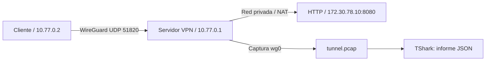

# 04 · VPN privada y monitoreo de tráfico

Laboratorio WireGuard de extremo a extremo. Un cliente que solo pertenece a la red de transporte alcanza un servidor HTTP de una red privada a través del túnel. TShark, la herramienta de línea de comandos de Wireshark, resume protocolos, conexiones y HTTP visible.



## Requisitos

- Docker con contenedores Linux y soporte WireGuard en el kernel de su VM/anfitrión.
- Rangos `172.30.77.0/24`, `172.30.78.0/24` y `10.77.0.0/24` sin conflictos con tus redes.
- Los servicios VPN necesitan `NET_ADMIN` dentro de sus espacios de red. La captura usa `NET_RAW` y `NET_ADMIN`; no se usa `privileged` ni red del anfitrión.

## Arranque y demostración

Desde esta carpeta:

```powershell
docker compose up -d --build
docker compose ps -a
python smoke.py
```

`init` termina con código 0 y conserva las claves en dos volúmenes separados. `vpn` y `client` deben aparecer saludables. La prueba espera el servicio privado, exige un handshake WireGuard, detiene la captura para cerrar el PCAP y genera `reports/traffic.json`. El resultado esperado es `Prueba integral OK`.

Comprobación manual:

```powershell
docker compose exec client ip route get 172.30.78.10
docker compose exec client curl --fail http://172.30.78.10:8080
docker compose exec client wg show wg0 latest-handshakes
docker compose exec vpn wg show wg0 transfer
docker compose stop capture
docker compose run --rm analyze
```

La ruta del cliente debe indicar `dev wg0`. El servicio web no publica puertos y el cliente no pertenece a su red Docker. El servidor solo reenvía tráfico del cliente hacia el segmento privado y permite sus respuestas. No se modifica el firewall o las rutas del anfitrión.

## Captura e interpretación

Abre `captures/tunnel.pcap` con Wireshark o revisa `reports/traffic.json`. La captura se realiza en `wg0`, donde WireGuard ya ha descifrado el paquete: por eso aparece HTTP. No significa que HTTP viajara sin cifrar por la red de transporte. La VPN protege el tramo entre sus extremos; HTTPS sigue siendo pertinente más allá del túnel.

Para observar paquetes cifrados en la red de transporte durante otra petición:

```powershell
docker compose exec vpn tcpdump -ni any udp port 51820
```

Para una nueva captura, ejecuta `docker compose up -d capture`; el PCAP anterior se sobrescribe. Detén siempre `capture` antes de analizar. Cada informe incluye cantidad de paquetes/bytes, protocolos, pares origen/destino/puerto y peticiones HTTP detectadas. Este es un analizador acotado: no clasifica todo protocolo en texto claro ni conserva contenido de archivos en el JSON.

## Alcance

La VPN es un túnel privado de laboratorio con rutas específicas. No convierte el equipo en una VPN pública, no cambia tu salida a Internet, no instala un cliente en Windows y no incluye un proxy HTTP. No se publican puertos del anfitrión; el cliente de prueba ya está incluido.

Si el kernel no soporta WireGuard, `ip link add ... type wireguard` fallará. Revisa la compatibilidad de Docker/WSL antes de usarlo; el proyecto no carga módulos del kernel anfitrión. Si Docker informa un conflicto de subred, ajusta de forma coherente Compose, `vpn.py`, el filtro de captura y `smoke.py`.

Pruebas del analizador sin Docker:

```powershell
python -m unittest discover -s tests -v
```

Para detener: `docker compose down`. Las claves persisten. `docker compose down -v` borra las claves de esta VPN; los PCAP e informes en carpetas locales se conservan.

Referencias: [WireGuard Quick Start](https://www.wireguard.com/quickstart/), [manual de TShark](https://www.wireshark.org/docs/man-pages/tshark).
