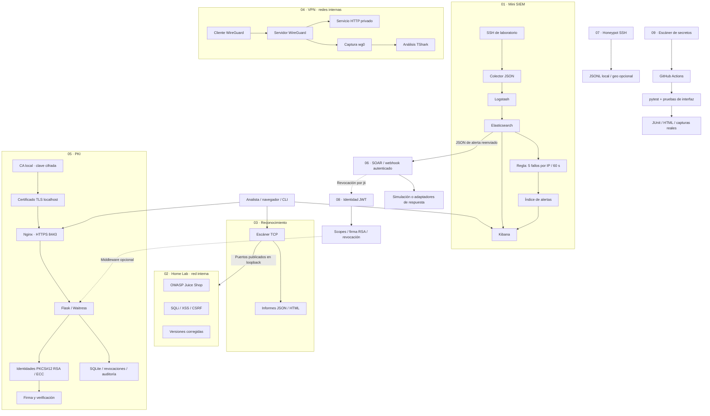

# Cybersecurity Labs

[](https://github.com/kronvael4196/cybersecurity-labs/actions/workflows/ci.yml)

Portafolio de nueve laboratorios de seguridad: SIEM, prácticas web, reconocimiento, VPN, PKI, SOAR, honeypot SSH, identidad JWT y detección de secretos. Incluye pruebas automatizadas, HTTPS con una CA local y generación de evidencias en GitHub Actions.

## Arquitectura



## Proyectos y stack

| Proyecto | Tecnologías | Funcionalidad |
| --- | --- | --- |
| [Mini SIEM](01-mini-siem/README.md) | Elasticsearch, Logstash, Kibana, OpenSSH, Python | Ingestión, búsqueda y alerta de intentos repetidos |
| [Home Lab](02-vulnerable-home-lab/README.md) | OWASP Juice Shop, Flask, SQLite, Docker | SQLi, XSS y CSRF frente a sus correcciones |
| [Escáner](03-network-scanner/README.md) | Python socket, hilos, IPv4/IPv6 | Auditoría TCP, identificación conservadora e informes |
| [VPN y tráfico](04-vpn-traffic-monitor/README.md) | WireGuard, iptables, tcpdump, TShark | Túnel privado, captura PCAP y análisis de conexiones |
| [PKI y firma](05-pki-digital-signature/README.md) | Flask, Waitress, cryptography, SQLite, Nginx | PKCS#12, RSA-PSS/ECDSA, verificación y CRL |
| [SOAR](06-soar-automation/README.md) | FastAPI, SQLite, iptables, HTTPX | Webhook autenticado, respuesta simulada y adaptadores reales |
| [Honeypot SSH](07-ssh-honeypot/README.md) | Paramiko, JSON Lines, ipapi.co opcional | Credenciales ficticias, shell simulada y enriquecimiento geográfico |
| [Identidad](08-identity-provider/README.md) | FastAPI, PyJWT, RSA, PBKDF2, SQLite | Login, scopes, verificación, revocación y middleware |
| [DevSecOps](09-devsecops-scanner/README.md) | Python, Regex, Git | Detección de secretos y bloqueo de CI sin revelar coincidencias |
| Automatización | pytest, pytest-html, Playwright, GitHub Actions | Tests, despliegues efímeros y evidencias |

## Requisitos y preparación

Python 3.12+, Git y Docker con Compose y contenedores Linux. Reserva al menos 6 GB de RAM para ELK. WireGuard requiere soporte del kernel Linux de Docker. En Windows, WSL 2 y Virtual Machine Platform deben estar operativos: `docker version` debe mostrar Client y Server.

```powershell
git clone https://github.com/kronvael4196/cybersecurity-labs.git
cd cybersecurity-labs
python -m venv .venv
.\.venv\Scripts\python.exe -m pip install -r requirements-dev.txt
.\.venv\Scripts\python.exe scripts/init_labs.py
.\.venv\Scripts\python.exe scripts/pytest_all.py
```

En Linux/macOS sustituye `.\.venv\Scripts\python.exe` por `.venv/bin/python`. `init_labs.py` genera credenciales aleatorias, no imprime sus valores y conserva cualquier `.env` existente.

## Despliegue

Ejecuta cada bloque desde la raíz. No es necesario levantar todos los laboratorios al mismo tiempo.

```powershell
# PKI mediante HTTPS; backend solo accesible dentro de Docker
docker compose --env-file 05-pki-digital-signature/.env -f 05-pki-digital-signature/compose.yaml up -d --build

# Aplicaciones vulnerables y corregidas
docker compose -f 02-vulnerable-home-lab/compose.yaml up -d --build

# Mini SIEM
docker compose --env-file 01-mini-siem/.env -f 01-mini-siem/compose.yaml up -d --build

# VPN privada con cliente y captura incluidos
docker compose -f 04-vpn-traffic-monitor/compose.yaml up -d --build

# SOAR, honeypot y proveedor de identidad
docker compose --env-file 06-soar-automation/.env -f 06-soar-automation/compose.yaml up -d --build
docker compose -f 07-ssh-honeypot/compose.yaml up -d --build
docker compose --env-file 08-identity-provider/.env -f 08-identity-provider/compose.yaml up -d --build
```

| Acceso | URL / puerto |
| --- | --- |
| PKI HTTPS | https://localhost:8443 |
| Redirección a HTTPS | http://localhost:8085 |
| Juice Shop / vulnerable / corregido | http://localhost:3001 / :3002 / :3003 |
| Kibana | http://localhost:5601 |
| Elasticsearch | http://localhost:9200 |
| SSH | `ssh -p 2222 analyst@127.0.0.1` |
| VPN | Sin puertos publicados; cliente incluido |
| SOAR / OpenAPI | http://localhost:8080/docs |
| Honeypot SSH | `ssh -p 2223 visitante@127.0.0.1` (interno 2222) |
| Identidad / OpenAPI | http://localhost:8001/docs |

Todos los puertos se enlazan a loopback. Home Lab y VPN tienen redes internas propias. ELK funciona sin autenticación y es exclusivamente local. Para HTTPS exporta la CA pública y sigue [la guía de confianza local](docs/HTTPS.md). Los tests no omiten verificaciones TLS. El token PKI se obtiene de `05-pki-digital-signature/.env`.

Si Docker no está disponible en Windows, `scripts/start_https_local.ps1` permite ejecutar Nginx portátil y la PKI local por HTTPS. No habilita virtualización ni modifica automáticamente el almacén de confianza del equipo.

Los módulos nuevos también pueden ejecutarse, cada uno en su terminal, con `python scripts/run_local_module.py 06`, `07` o `08`. Se enlazan a loopback; el SOAR local fuerza simulación. Para detenerlos usa Ctrl+C. El módulo 09 es una CLI: `python 09-devsecops-scanner/scanner.py .`.

## Pruebas funcionales

```powershell
# Reportes pytest HTML, JUnit y JSON
.\.venv\Scripts\python.exe scripts/pytest_all.py

# Auditar los contenedores web mediante sus puertos locales
python 03-network-scanner/scanner.py 127.0.0.1 --ports 3001-3003 --probe --output artifacts/scanner/home-lab

# Tras el arranque de Logstash y Kibana
cd 01-mini-siem
python scripts/smoke.py
cd ..
python scripts/kibana_dashboard.py
```

En PKI: emite una identidad, firma un archivo y verifica su JSON en la interfaz. Modifica el archivo y revoca el certificado para comprobar los rechazos. El dashboard importado está en `http://localhost:5601/app/dashboards#/view/mini-siem-overview`. [La guía de evidencias](docs/EVIDENCE.md) describe las pruebas y capturas.

## CI y evidencias

Consulta la [galería de capturas y resultados verificados](docs/evidence/README.md): firma digital, revocación, Kibana, escáner, Home Lab y pytest.

Cada `push` y `pull_request` ejecuta [.github/workflows/ci.yml](.github/workflows/ci.yml):

1. Pruebas con Python 3.12 y 3.14, revisión de secretos y validación de Compose.
2. Despliegue efímero Nginx/PKI y Home Lab; TLS, escáner y firma por interfaz.
3. Despliegue ELK/SSH; fallos reales, ingesta/alerta y captura del dashboard.
4. Informes y capturas como artefactos de la ejecución, con retención de 14 días.
5. Jobs `soar-tests`, `devsecops-scan` y `new-modules-integration`: webhook, escaneo del repositorio, login/revocación JWT y conexión real al honeypot. Las suites de los nueve módulos también se ejecutan en ambas versiones de Python.

La CA y credenciales del runner son efímeras. Los artefactos no incluyen PKCS#12, claves, bases de datos ni `.env`. El workflow despliega ambientes de prueba, no servicios públicos. Consulta [VALIDATION.md](VALIDATION.md) para el estado observado. Las evidencias de ejecuciones fallidas se conservan para diagnóstico y no se presentan como pruebas exitosas.

## Seguridad y mantenimiento

- `.gitignore` excluye secretos/datos; `python scripts/check_secrets.py` comprueba el contenido versionado antes de publicar.
- Nginx admite TLS 1.2/1.3 y recibe únicamente su clave de servidor y certificados públicos.
- Las apps vulnerables usan datos ficticios y son para práctica local autorizada.
- Un puerto abierto no demuestra una vulnerabilidad. La PKI no proporciona PAdES ni confianza pública. La VPN no cambia tu salida personal a Internet.
- `docker compose down` dentro de cada proyecto conserva sus volúmenes; `down -v` elimina sus datos y claves.

Licencia [MIT](LICENSE) para el código de esta colección. Las herramientas e imágenes de terceros conservan sus propias licencias.
