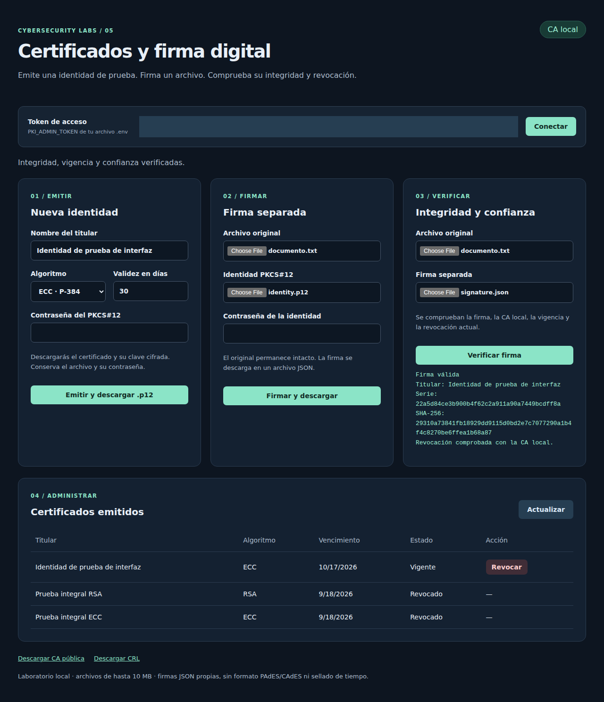
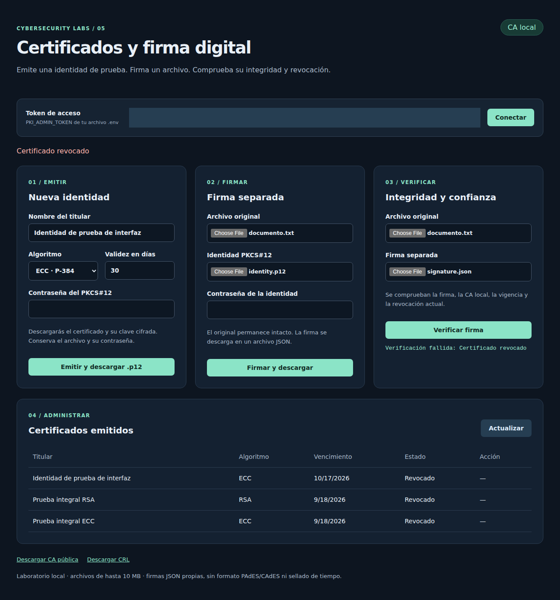
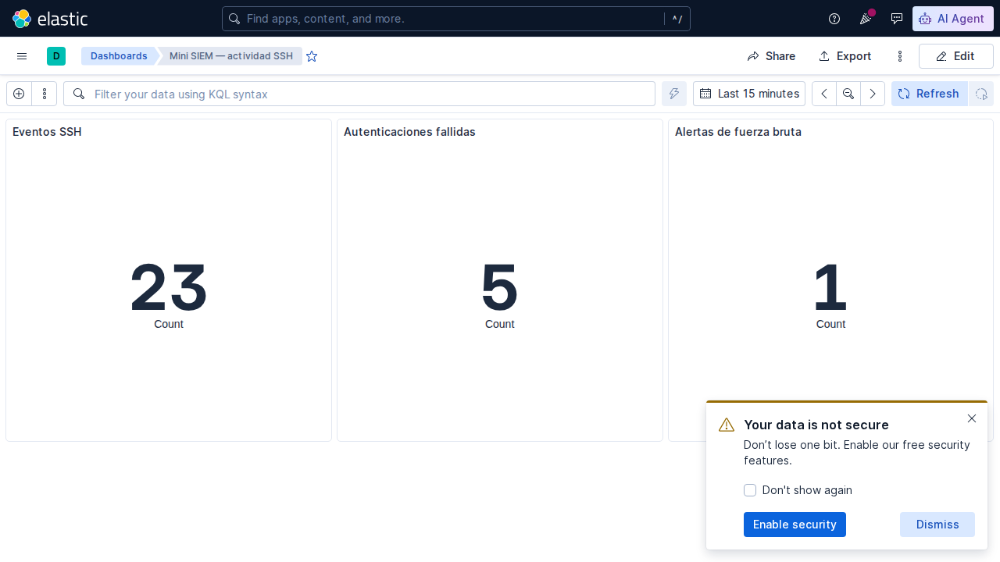
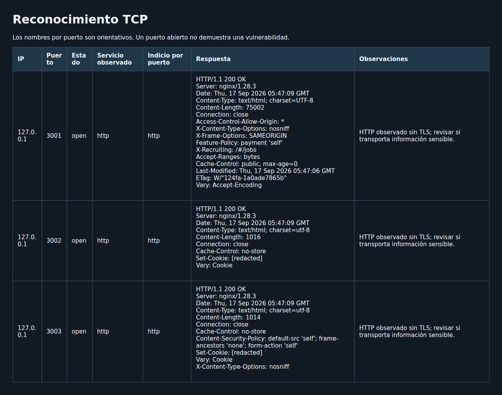
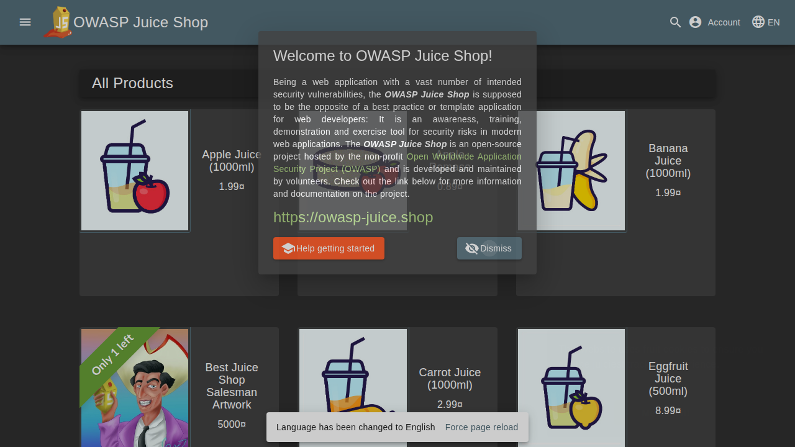
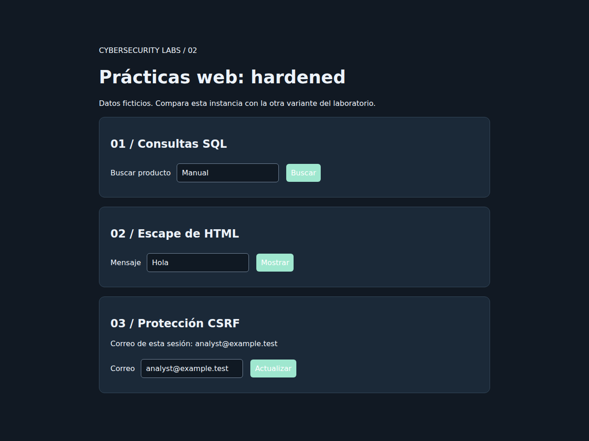
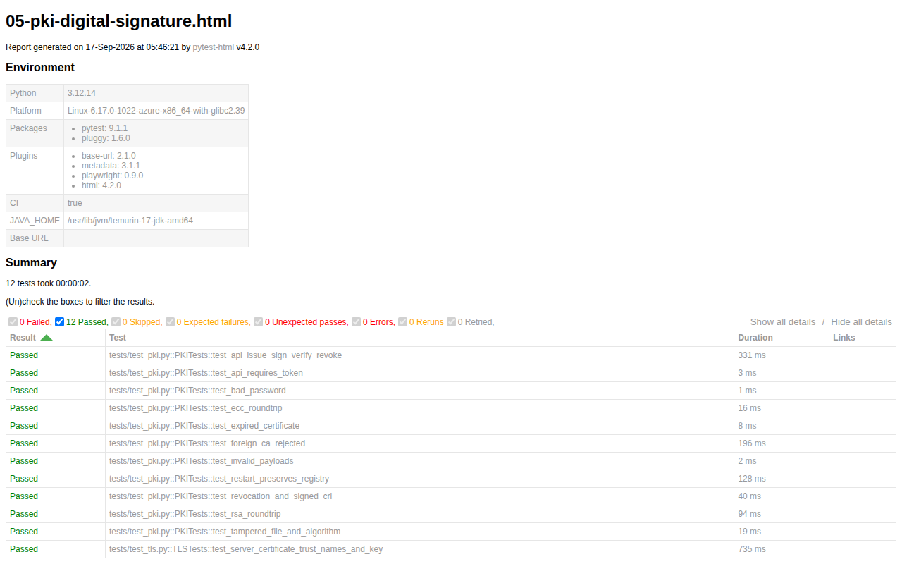

# Galería de evidencias

Capturas reales de pruebas automatizadas, con datos ficticios. Se obtuvieron el **17 de septiembre de 2026** en GitHub Actions sobre Linux y Chromium. El token de administración está enmascarado; las cookies se ocultan antes de guardar el reporte del escáner.

Origen: [ejecución 35186974666](https://github.com/kronvael4196/cybersecurity-labs/actions/runs/35186974666), commit [`15925c5`](https://github.com/kronvael4196/cybersecurity-labs/commit/15925c535abd6212c3cdd977c37bdd17a16a95f0). Las imágenes se copiaron de los artefactos `web-functional-evidence` y `siem-functional-evidence`; los resúmenes pytest proceden de `pytest-3.12` y `pytest-3.14`.

## Resultados

| Comprobación | Evidencia |
| --- | --- |
| 31 pruebas aprobadas con Python 3.12 | [Resumen JSON](pytest-3.12-summary.json) |
| 31 pruebas aprobadas con Python 3.14 | [Resumen JSON](pytest-3.14-summary.json) |
| 3 pruebas de interfaz web aprobadas | [JUnit web](e2e-web.xml) |
| 1 prueba de dashboard aprobada | [JUnit SIEM](e2e-siem.xml) |
| 5 fallos SSH, 1 acceso válido y 1 alerta | [Salida de la prueba](ssh-smoke.txt), [alerta Elasticsearch](siem-alerts.json) |
| 3 puertos HTTP abiertos | [Reporte JSON del escáner](scanner-home-lab.json) |
| RSA/ECC sobre HTTPS | [Salida de la prueba PKI](pki-smoke.txt), [cabeceras HTTPS](https-headers.txt) |

## Identidad PKCS#12 y firma válida

La prueba descarga una identidad `.p12`, firma un archivo y vuelve a cargar el original y su firma JSON. La interfaz confirma integridad, vigencia, confianza y revocación.

## Revocación

Después de revocar el certificado, la misma firma se rechaza. También se comprueba el rechazo de un archivo modificado.

## Ingesta SSH y alerta en Kibana

Los intentos se realizan contra el servidor SSH de laboratorio. El dashboard muestra el total de eventos SSH, cinco autenticaciones fallidas y una alerta. El total incluye otros mensajes de sesión y puede variar entre ejecuciones. La advertencia de Kibana corresponde a la autenticación desactivada en este laboratorio limitado a loopback.

## Auditoría de los contenedores web

El escáner accede a los puertos de loopback publicados por el gateway del Home Lab: Juice Shop, la aplicación vulnerable y la aplicación corregida. Identifica HTTP en los tres; no atribuye vulnerabilidades a partir de un puerto abierto.

## Home Lab en funcionamiento

## Evidencia de pytest

El informe de la suite PKI muestra sus 12 pruebas aprobadas. Los resúmenes JSON enlazados arriba contienen las cinco suites: 31 pruebas por versión de Python.

Para reproducir estas evidencias consulta [EVIDENCE.md](../EVIDENCE.md). Los artefactos completos de Actions tienen retención de 14 días; esta selección permanece versionada. El estado y las limitaciones, incluido WireGuard aún sin prueba de túnel, se describen en [VALIDATION.md](../../VALIDATION.md).
